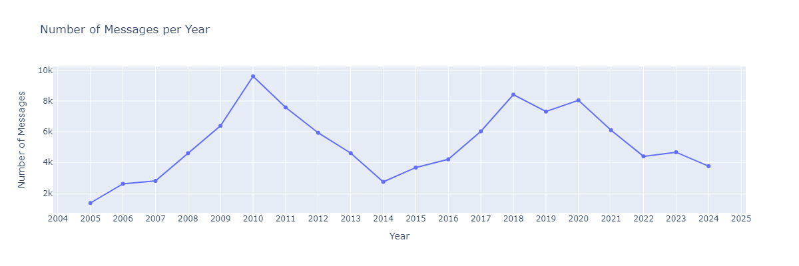
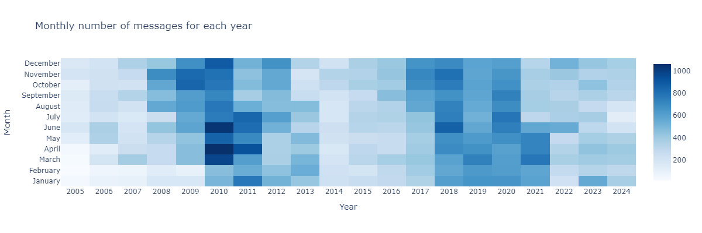
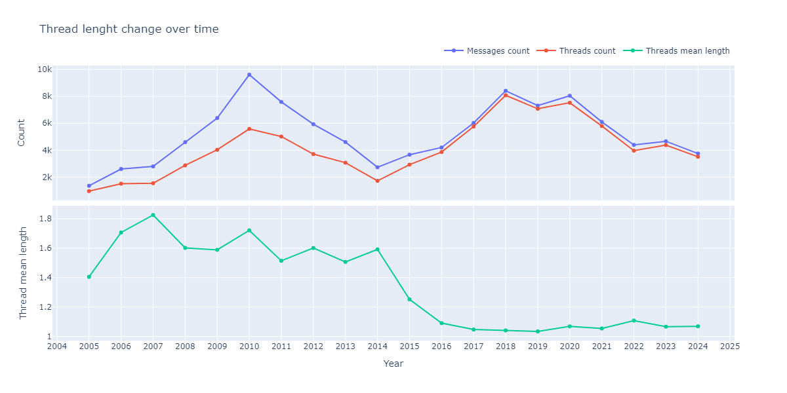
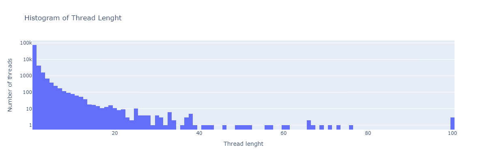

I've had the same gmail account since 2004 and I no longer know what is in there. Exploring 20 years of accumulated history using the Gmail App or other Email apps doesn't work very well. These apps where not designed for this type of analysis. Instead, I've decided to run my own custom exploratory analysis, based on the data I can download using GMail's API.

## Getting the Data
I'll provide more details on how I got the data and the processing I did to extract the fields I'm intersted in. But the basics are that I used the [Gmail API for Python](https://developers.google.com/gmail/api/quickstart/python) and downloaded all the [Messages](https://developers.google.com/gmail/api/reference/rest/v1/users.messages#Message) from by two gmail accounts, from the years 2004 to 2024. From the payload, I only download the Headers which include the email's date, sender, and title. 

After combining the data from the Message and Headers, each entry includes
```json
// Entry
{
  "id": string,
  "thread_id": string,
  "label_ids": [
    string
  ],
  "snippet": string,
  "received_date": Datetime,
  "sender_address": string,
  "title": string,
}
``` 

The sender address string has the format `local-part@domain`, where domain sometimes contains a subdomain. For example, in the address `recommendations@explore.pinterest.com` the domain is the string `explore.pinterest.com` where the first part is the subdomain, an the rest is the root domain: `{subdomain: explore, root_domain: pinterest.com}`. 

## Exploratory data analysis
> While working on this analysis, I'm reading the amazing book "Visualization Analysis & Design" by Tamara Munzner. Much of what I present here is based on the topics of this book, and I might revisit some of the visualization after I finish reading.

I'll look at the data starting on Jan, 2005 and ending on Dec 2024, to have 20 full years of data. Let's first get some basic statistics to get an idea of the amount of data I have: {.mb-1}
- The messages span 7,302 days, approx. 240 months
- There are 104,776 messages, comming from 82,842 different threads of conversation
- There messages come from 5,255 unique email addresses, counting 2,383 different @domains (1,833 different _root_ domains)
- There are 35 different labels used, and 87.9% of the messages have one or more label.

### Messages Count
The first plot below shows the volume of messages over time. We can see the number of emails increases until  2010, and it starts to decrease until 2014 where it picks back up. The year with more messages is 2010, with almost 10k emails, and the one with less is 2014 with close to 2k messages.


{.plot}

The second plot shows the details per month of the year. Although we loose the precision of our bar plot, this heatmap can helps us see if there is any seasonal distribution. For example, we see that in 2010 the increase in emails starts rapidly around March and decays in June. 

**Can we map the changes to events in my life?** Interestingly, 2010 was my last year in collegue and March-June was the first semester. I graduated highschool in Dec 2004 and started my undergrad in March 2005. I graduated from undergrad+master in Dec 2010, and moved to the US in Jan 2011. I started my PhD in Sept 2013, graduating in Sept 2019.

{.plot}

### Thread Lenght
In Gmail, email threads are chains of related messages which are group together by subject line. I'm interested in understanding how the thread length (i.e., number of messages in the thread chain) changed over time. For that, I computed the average thread lenght for each year. The plot below shows how the average thread lenght has decreased, from a high of 1.8 in 2007 to almost 1.1 in 2024. I believe this is a big clue of the change in usage of my gmail: a thread count of 1.0 means these are emails that do not require any reply.

We can also see that, while the message count is highest in 2010, the thread count (number of different threads) is highest in 2018-2020.

{.plot}

To undestand the change better, I want to show the variance of  thread lenght, but there are a few cases with hundreds of messages per-thread (outliers) that make visualizing this a bit more difficult. The plot below shows an histogram of the thread lenght, but I've used a logarithim scale for the thread count so we can see the few cases with lenght 100.
{.plot}

### Next ...
In the next post, I'll look into the different domains where the data comes from, and the labels provided by gmail.